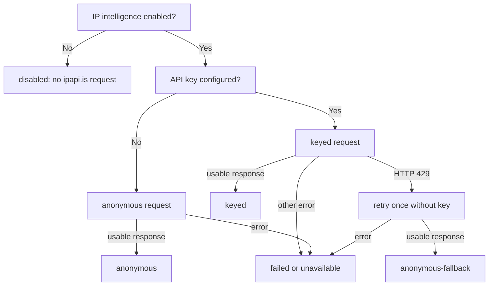

# IP Intelligence Modes

PingMetric keeps IP discovery separate from provider intelligence. The default IP checks use ipify to learn which public IPv4/IPv6 paths are reachable. IP intelligence is a separate, persisted opt-in using ipapi.is. M-Lab NDT7 measures download/upload performance; WebRTC/STUN checks browser-visible ICE candidates.

The preference is stored in the browser under `ping-metric.ip-intelligence-enabled.v1` and defaults to `false`.

## Modes

- **disabled**: the user has not enabled IP intelligence. PingMetric does not construct or send an ipapi.is request. There is no anonymous request in this mode.
- **keyed**: the user enabled IP intelligence and the configured API key was used successfully.
- **anonymous**: the user enabled IP intelligence, no key is configured, and ipapi.is was requested without a key.
- **anonymous-fallback**: a keyed request returned HTTP 429, so PingMetric retried once without the key and the anonymous response was usable.

Only a keyed HTTP 429 triggers the anonymous retry. Keyed 500 responses, network errors, and anonymous 429 responses do not cause retries. A disabled result is distinct from a failed or unavailable provider.

## Data Sources

- **ipify** is used for public IP discovery. It does not provide ISP, ASN, or network security classifications.
- **ipapi.is** is contacted only after the user enables IP intelligence. It may return ISP/ASN ownership, approximate location, and security classifications. Missing provider fields remain unknown; PingMetric does not turn them into “not detected.”
- **M-Lab NDT7** performs the separately disclosed speed measurement.
- **WebRTC/STUN** is used only when the user starts the WebRTC check; it reports ICE candidates exposed by the browser.

Disabling IP intelligence aborts the active request, clears current IPAPI-derived dashboard state, and ignores any response that arrives after disable. The preference is stored locally; provider results in old history entries remain local and are hidden in History while the preference is off.

Environment values are compiled into the browser bundle. An API key in a static browser application is not a server-side secret: users can inspect requests and client code. Only use a key explicitly intended for public browser clients. PingMetric has no backend and does not proxy provider requests.
