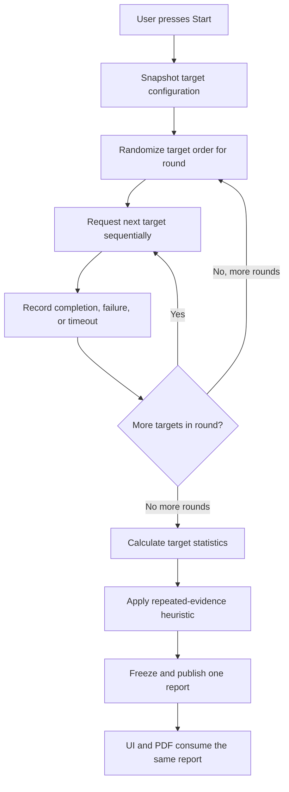

# Net Neutrality Check

## Scope

PingMetric's Net Neutrality Check is an **experimental browser heuristic**. It compares timing and reachability for lightweight public resources associated with YouTube, Facebook, Google, and Wikipedia. It does not determine whether a provider violated net-neutrality rules, and it does not infer intent.

A speed test measures end-to-end throughput by transferring data. This check instead records how browser requests to selected service paths complete over time. Reachability, timing, and application-specific traffic differentiation are related but different observations: a failed request is not automatically a block, and a slow request is not automatically throttling.

## Method

No target request is made when the page is opened. The user must choose **Start Net Neutrality Check**. Another run requires the explicit **Run Again** action. The configured targets are public and unauthenticated; PingMetric does not use accounts, cookies, page scraping, or authenticated APIs.

Each request is a sequential `GET` with `mode: 'no-cors'`, `credentials: 'omit'`, `cache: 'no-store'`, and `referrerPolicy: 'no-referrer'`. A cross-origin response may be opaque. In that case the browser does not expose status or body; a resolved fetch is recorded only as a completed browser request and timed. PingMetric does not claim that an opaque response was HTTP 200 or inspect its content.

The default environment configuration is:

| Setting                          |                              Default |
| -------------------------------- | -----------------------------------: |
| Services                         | YouTube, Facebook, Google, Wikipedia |
| Rounds / attempts per service    |                                    5 |
| Total requests on a complete run |                                   20 |
| Execution                        |                           Sequential |
| Target order                     |  Randomized independently each round |
| Timeout per request              |                             5,000 ms |
| Minimum successful samples       |                                    3 |
| Relative ratio threshold         |                                 2.5× |
| Absolute difference threshold    |                               150 ms |

These are PingMetric heuristics, not an industry standard. Values are configured centrally in the environment and copied into each immutable report.

## Statistics and Heuristic

Each attempt records its target, round, start timestamp, elapsed time when measured, and `success`, `failed`, or `timed-out` outcome. Timing summaries use completed successful requests only.

- **Success rate** = successful attempts / total attempts × 100.
- **Minimum, median, and maximum** are calculated from successful attempt durations.
- **Variation** is median absolute deviation (MAD): the median of each successful duration's absolute distance from that target's median.
- **Reference median** for a target is the median of the available medians for the other services.
- **Relative ratio** = target median / reference median when the reference is greater than zero.
- A timing threshold is `max(reference median × 2.5, reference median + 150 ms)` under the default configuration.
- A target is `slower-path-observed` only when it has at least three successful samples, its median exceeds the threshold, and at least three of its individual successful samples also exceed that threshold. One outlier cannot trigger this result.

The default thresholds are intentionally conservative starting points. They are not validated standards and should not be treated as a scientific boundary.

### Per-target classifications

- **normal**: enough timing data exists, but repeated timing did not exceed both configured thresholds.
- **slower-path-observed**: the repeated timing rule above was met.
- **reachability-problem**: fewer than the minimum successful samples were available and one or more requests failed or timed out. This describes an observation only; it does not say who caused it.
- **inconclusive**: there is too little timing data and no classified reachability problem.

### Overall classifications

- **No obvious differential behavior observed**: every target has the minimum successful sample count and none has a repeated slower path.
- **Potential differential behavior observed**: every target has the minimum successful sample count and at least one target meets the repeated slower-path rule.
- **Inconclusive**: any target lacks the minimum successful timing samples, or the data is otherwise insufficient for a comparison.

A reachability issue by itself yields an inconclusive overall result, never an automatic blocking classification. The report's explanation and all exact thresholds are retained with the result.

## Scientific and Browser Limitations

Controlled replay tools such as Wehe compare application-like traffic with control traffic over repeated measurements, then statistically compare the results. PingMetric's static GitHub Pages browser app cannot perform arbitrary low-level packet capture or replay equivalent to a native Wehe client. It therefore uses a browser-visible timing heuristic, not a Wehe reproduction.

Observed differences can be caused by CDN placement, destination server location or load, peering, routing, DNS, VPNs, proxies, corporate security gateways such as Zscaler, firewalls, browser extensions, temporary congestion, service outages, rate limits, or actual blocking/throttling. These effects can create false positives or hide real differences. Repeating tests at different times and on different access paths can provide stronger context, but still does not prove intent or establish a legal violation.

The test uses browser requests only. It does not send ICMP, inspect packet contents, inspect opaque response bodies, or claim response status when CORS prevents access.

## Report and PDF Privacy

The UI and PDF use the exact same completed `NetNeutralityReport`; PDF generation does not recalculate statistics or rerun tests. Reports contain methodology/configuration, rounds/order, each attempt, target summaries, classifications, and explanation.

PDF export is entirely client-side with jsPDF and jsPDF-AutoTable. It performs no measurements and no IPAPI requests. By default, network identity and public IP addresses are excluded. Two separate unchecked options are required:

- **Include network identity details** may add ISP, ASN, country, region, and city from already stored history data.
- **Include public IP addresses** may add previously stored IPv4/IPv6 values. Enabling identity does not enable this option.

WebRTC candidate addresses, coordinates, postal codes, provider details, abuse contacts, API keys, and full user-agent strings are not included by either option. The PDF records which options were selected. It is a measurement report, not legal proof.
